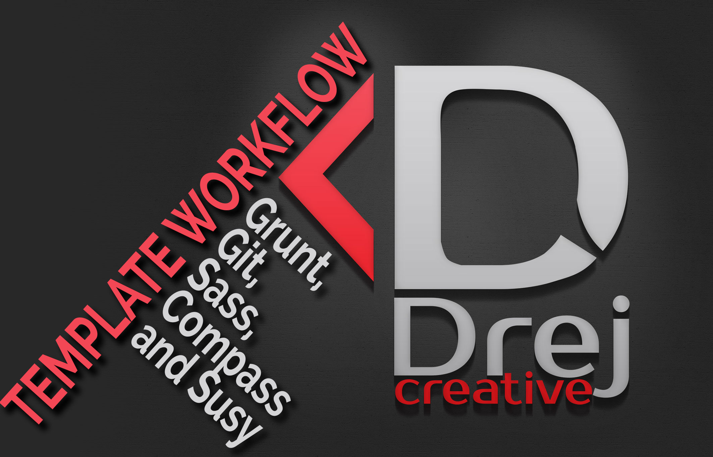

# Template for Grunt workflow with Git, Sass, Compass and Susy responsivce framework

This is my template for simple Grunt workflow with Git, Sass, Compass and Susy. This template give you few thing. First, grunt compile your Sass into css, then you can automatically minify your css and javascripts, then give you livereload of your web project in browser.

##Instructions

Make sure you have these installed

1. [Node.js](hwww.nodejs.org).
2. [git](www.git-scm.com).
3. [grunt](www.gruntjs.com).

Clone this repository into your local machine using the terminal (mac) or Gitbash (PC)
`git clone  https://github.com/drejcreative/Template-for-Grunt-workflow.git`

CD to the folder with workflows
Run > `npm-install` to install the project dependencies

Install grunt.js via the Mac terminal or Gitbash on a PC > `npm install -g grunt-cli`

Run the Grunt command > `grunt`

And open index.html in your browser and you are set to go
